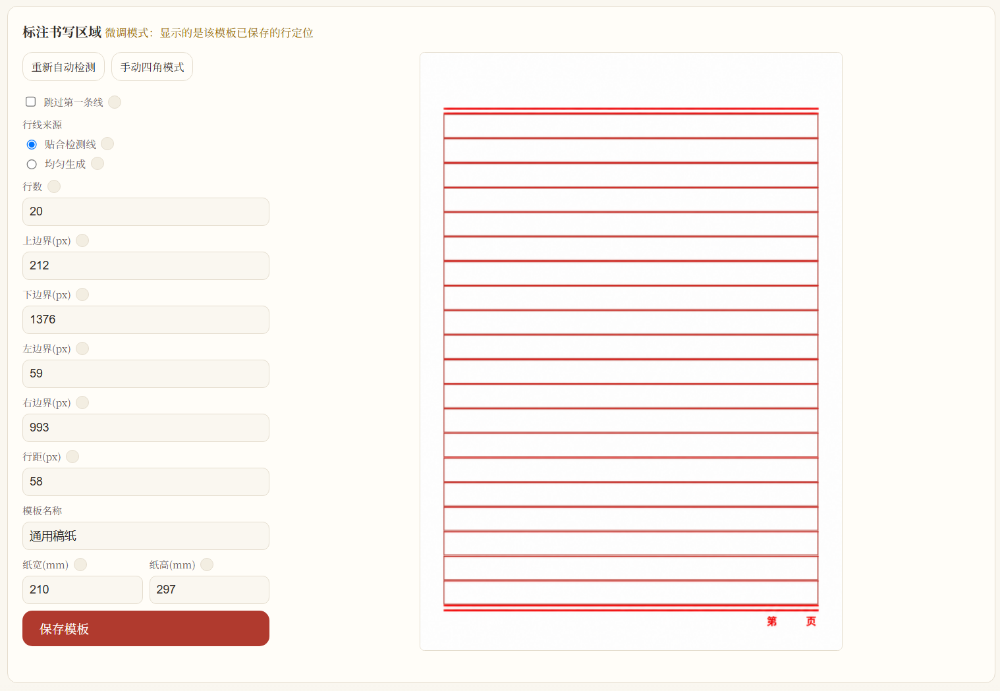
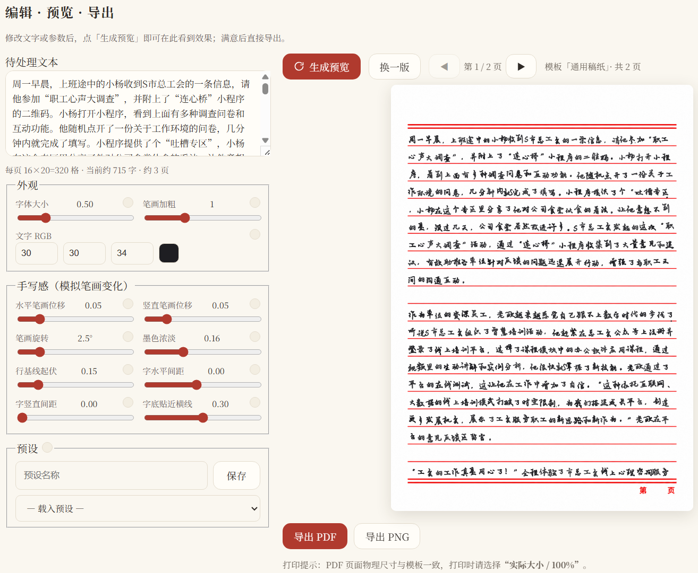
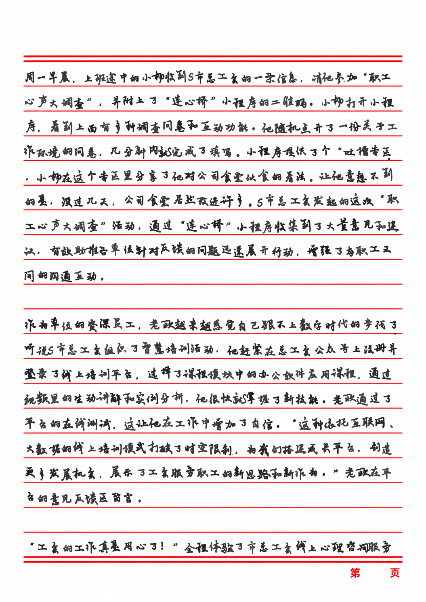

# 墨仿 Mofang 用户文档

> ⚠️ 仅供学习交流，请勿用于提交作业等需要真实手写的场合。

## 一、安装

### 方式一：一键启动（推荐，Windows）

1. 双击项目根目录的 `start.bat`。首次运行会自动创建 conda 环境 `mofang` 并安装依赖（需联网，约几分钟）。
2. 完成后浏览器自动打开 `http://127.0.0.1:8642/`，即网页版界面。

### 方式二：桌面版

1. 先运行一次 `start.bat` 完成环境初始化；
2. 之后每次双击 `桌面版.bat`（或 `dist\Mofang\Mofang.exe`）打开桌面应用——无任何黑色控制台窗口，直接出现软件主窗口。桌面版是原生窗口内嵌网页版界面，使用方式与网页版完全相同。

### 方式三：手动安装

见 [README 快速开始](../README.md#快速开始)。

**系统要求**：Windows 10/11（其他平台可手动运行，需 Python 3.10+）、已安装 [Miniconda](https://docs.conda.io/en/latest/miniconda.html)。

## 二、功能与使用方法

完整流程共 3 步：**模板 → 字体 → 编辑 · 预览 · 导出**。第三步是同一工作页：修改文字或参数后点「生成预览」就地刷新效果，满意后直接导出，无需跳转。

### 1. 模板（稿纸）

- **使用已有模板**：点击模板卡片选中（出现红色对勾）。**双击名称可重命名**；悬停卡片可「调整」或删除。
- **上传新模板**：点击「上传新模板」，选择稿纸照片（jpg/png/webp/bmp）。标注器会**自动视觉定位**（约 0.3 秒）：检测全部横线与书写区左右边界，行基线逐行贴合真实横线（横线间距不均的拍照件也能精确对齐）；**倾斜照片自动纠斜**（文字沿倾斜横线书写，导出仍为原角度）。

**标注器（左侧按钮与参数，右侧实时预览，单屏显示）**：

| 控件 | 说明 |
|---|---|
| 重新自动检测 / 手动四角模式 | 自动检测失败（无线稿纸、深色纸、严重歪斜）时自动切到手动四角：依次点击左上→右上→右下→左下，之后同样可微调 |
| 行线来源 | **贴合检测线**（默认）：使用检测到的真实横线，上下边界只做筛选；**均匀生成**：在上下边界间按行数等距生成行线，不依赖检测——检测不准时用它 + 四边界 + 行数手工对齐 |
| 跳过第一条线 | 勾选后第一行字写在第 1、2 条横线之间（页首线留空，符合书写习惯）；均匀生成模式下自动禁用（上边界即第一行） |
| 行数 | 保留的书写行数，默认为检测数量；贴合模式=从上往下截取，均匀模式=按行数等距生成（可增可减） |
| 上/下边界(px) | 第一行/最后一行字的书写基线 y。上下收紧可避免压页脚；均匀模式下直接定义行线范围 |
| 左/右边界(px) | 书写区左右边界，减少左右留白 |
| 行距(px) | 手动四角模式的行间距（自动模式下已按真实横线逐行贴合，仅作显示） |
| 纸宽/纸高(mm) | 稿纸实际物理尺寸，决定导出 PDF 页面大小与打印对齐（A4=210×297） |

调整后**无需手动保存**——点「下一步」会自动保存为模板并选中；「保存模板」按钮用于显式命名保存。已保存的模板随时可从卡片「调整」再次微调（原地更新）。

### 2. 字体

- 点击卡片选择字体，卡片上的「永字八法」为实时预览（浏览器动态加载字体渲染）。
- 「导入字体文件」支持 `.ttf/.otf/.ttc`（用第三方工具做好的手写字体直接导入即可）。
- 损坏的字体文件会在页面顶部提示。

### 3. 编辑 · 预览 · 导出（同一工作页）

左侧输入文本并调参，右侧即时预览与导出：

| 参数 | 说明（越大越……） | 默认 |
|---|---|---|
| 字体大小 | 字高占行高的比例，越大字越大、每行字越少 | 0.50 |
| 笔画加粗 | 越大笔画越粗（按压重/出墨多），太大糊 | 1 |
| 文字 RGB | 墨水颜色（蓝黑钢笔可用 30,45,90） | 30,30,34 |
| 水平/竖直笔画位移 | 越大落笔越乱、越潦草；0=整齐 | 0.05 |
| 笔画旋转 | 越大字歪得越厉害；0=端正 | 2.5° |
| 墨色浓淡 | 越大深浅反差越大；0=均匀 | 0.16 |
| 行基线起伏 | 越大整行起伏越明显；非 0 会偏离真实横线 | 0.15 |
| 字水平间距 | 越大越疏（每行字越少）；负值越紧凑甚至搭笔 | 0 |
| 字竖直间距 | 越大行距越松、逐行偏离横线；0=精确贴合 | 0 |
| 字底贴近横线 | 越大字越往下压、越贴近甚至压住横线 | 0.30 |

左侧底部实时显示容量估算。**所有参数改动拖动即时生效**：拖动时显示低清快速预览（约 0.1 秒），松手自动全分辨率精修。

**预设**：调好后输入名称点「保存」，下次从下拉框载入。预设包含参数 + 当时选的模板/字体，**网页版与桌面版通用**。

**预览**：「生成预览」渲染第 1 页；多页文档用预览上方的 **◀ 第 X / N 页 ▶** 翻页（翻页秒切，不重新渲染）；「换一版」重新随机并停留在当前页。缺字、超容量等信息显示在预览上方与黄色提示条中。

**导出**：
- **PDF（推荐）**：页面物理尺寸与模板一致。打印时务必选择 **“实际大小 / 100%”**，取消“适应页面/缩放”，即可与实体稿纸对齐。
- **PNG**：全部页面打包为一个 zip 下载（每页一个 `mofang_pNN.png`）。

桌面版（pywebview 原生窗口）内嵌与网页版完全相同的界面，功能和操作方式 100% 一致。

### 渲染效果示例

## 三、快捷键

| 快捷键 | 作用 | 位置 |
|---|---|---|
| Tab / Shift+Tab | 在参数间移动焦点 | 全局 |
| Enter（输入框内） | 确认/触发默认按钮 | 表单 |
| Ctrl+滚轮 | 缩放页面 | 浏览器 |

> 网页版当前以鼠标操作为主，暂无自定义快捷键；桌面版均为按钮操作。

## 四、常见问题（FAQ）

**Q：打印出来的字和实体稿纸对不齐？**
A：① 打印设置必须选“实际大小/100%”；② 确认模板的物理尺寸（宽/高 mm）与实体纸一致（默认 A4）；③ 家用打印机进纸有 ±2mm 机械偏差，属正常，可微调模板标注补偿。

**Q：为什么有些字明显不像手写体？**
A：那是主字体缺字后用系统备用字体顶替的。预览页黄色提示条会列出缺字清单；换一个字形更全的字体，或用字体工具补字。

**Q：提示“超出容量 N 格”？**
A：文字量超过模板容量，超出部分未渲染。删减文字或标注更多行数/行距更小的模板。

**Q：上传图片/字体报“格式不支持”或“文件损坏”？**
A：模板支持 jpg/jpeg/png/webp/bmp；字体支持 ttf/otf/ttc。请确认文件完整未加密（某些字体网站下载的 ttc 需解密）。

**Q：网页版端口被占用？**
A：编辑 `start.bat` 把 `8642` 改成其他端口（两处都要改）。

**Q：照片拍歪了能用吗？**
A：能。上传时会自动估计倾角并纠斜（检测与渲染都在摆正后的坐标系进行，文字沿倾斜横线书写，导出仍为原角度）。极端透视（侧拍）建议重拍，或用手动四角 + 均匀生成手工对齐。

**Q：桌面版 exe 双击报错 / 打不开？**
A：① 首次运行 Windows SmartScreen 可能拦截，点「更多信息 → 仍要运行」；② 程序需对 exe 所在文件夹有写权限（首次运行会在 exe 旁生成 data/ 目录，请勿放在只读路径）；③ 若弹出错误对话框，日志已写入 `data/mofang-error.log`，按日志信息排查或反馈。
